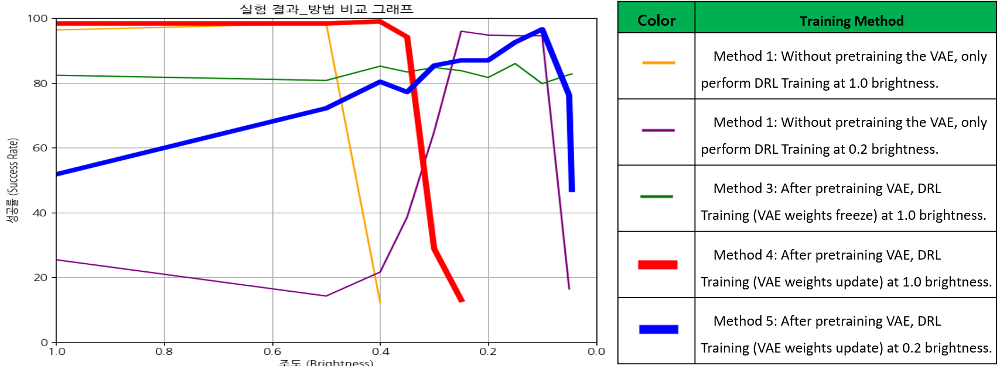

# Robust Autonomous Navigation in Low-Light Environments using VAE+ and DDPG

[cite\_start]This repository contains the implementation for the research paper: **"Robust Autonomous Navigation in Low-Light Environments with Camera-Based VAE+ and Deep Reinforcement Learning"**[cite: 1].

[cite\_start]The project develops a control agent capable of robust autonomous driving and obstacle avoidance in various lighting conditions, particularly in dark environments where depth camera performance degrades[cite: 16, 19]. [cite\_start]The solution leverages a unique combination of a specialized Variational Autoencoder (VAE+) for perception and a Deep Deterministic Policy Gradient (DDPG) agent for control[cite: 1].

## 1\. Problem Statement

[cite\_start]Standard depth cameras struggle to recognize object distances and shapes in low-light (low illuminance) environments[cite: 19]. This poses a significant challenge for autonomous navigation systems that rely on visual input for safety and pathfinding. [cite\_start]This project aims to create a control model that can navigate reliably regardless of the ambient brightness[cite: 16].

## 2\. Proposed Architecture

[cite\_start]Our approach is a two-stage process involving representation learning with a custom VAE and then policy learning with DDPG[cite: 36, 37].

\
\> [cite\_start]*High-level overview: A pre-trained VAE+ Encoder provides latent state vectors to the DDPG agent, which then learns to navigate the environment. [cite: 21, 35, 36, 37]*

### Stage 1: VAE+ for Robust Feature Extraction

To handle varying lighting conditions, we designed a **VAE+**, a modified Variational Autoencoder architecture. [cite\_start]Its primary role is to reconstruct a clean, bright depth image from a potentially dark and noisy input, and in doing so, learn a feature representation that is robust to changes in illuminance[cite: 381, 382].

The key modifications are in the **Encoder**:

  * [cite\_start]**CBAM (Convolutional Block Attention Module)**: We incorporated channel and spatial attention mechanisms to help the model focus on more salient features of the input image[cite: 59, 381].
  * [cite\_start]**FPN (Feature Pyramid Network)**: The encoder uses an FPN structure with a bottom-up and top-down pathway to create a rich hierarchy of features, enhancing its representational power[cite: 58, 110, 381].

\
\> [cite\_start]*Detailed architecture of the VAE+ Encoder, incorporating FPN and CBAM blocks. [cite: 57]*

### Stage 2: DDPG for Navigation Control

[cite\_start]The navigation agent is based on the Deep Deterministic Policy Gradient (DDPG) algorithm, which is ideal for continuous action spaces (linear and angular velocity)[cite: 29].

The agent's neural networks receive a concatenated state vector composed of:

1.  [cite\_start]**Visual Features ($z\_1, z\_2$)**: Latent vectors generated by passing the input from two depth cameras through the pre-trained VAE+ encoder[cite: 125, 126, 127].
2.  [cite\_start]**Navigation Features**: The agent's own state from the previous timestep, including linear velocity ($v\_{t-1}$), angular velocity ($\\omega\_{t-1}$), and its relative position to the goal (distance $d\_{goal}$ and angle $\\theta\_{goal}$)[cite: 119, 120, 121, 122, 123].

\
\> [cite\_start]*Architecture of the Actor and Critic networks within the DDPG agent. [cite: 118]*

## 3\. Experimental Setup

### Environment

  * [cite\_start]**Simulator**: Gazebo [cite: 175]
  * [cite\_start]**World**: An 8x8 meter indoor space containing walls and desks[cite: 175].
  * [cite\_start]**Obstacles**: The environment includes desks with thin legs, which are designed to be difficult to detect by traditional 2D-LiDAR sensors, making camera-based avoidance essential[cite: 176].
  * [cite\_start]**Task**: The agent must navigate from a starting point to a randomly assigned goal location in each episode while avoiding all obstacles[cite: 177].

### Agent

  * [cite\_start]**Base Model**: A customized TurtleBot3 Waffle-Pi, with its height extended to 0.75m[cite: 183].
  * [cite\_start]**Sensors**: Two depth cameras, each with a 120° field of view[cite: 182].

### Reward Function

The agent is trained using a carefully designed reward function:

  * [cite\_start]**Major Rewards**: A large positive reward for reaching the goal (`+2500`) and a large negative penalty for collisions (`-2000`)[cite: 205, 227].
  * [cite\_start]**Shaping Penalties**: Smaller penalties are given to encourage efficient navigation, such as minimizing the angle to the goal, maintaining an optimal speed, and avoiding unnecessary rotations or proximity to obstacles [cite: 206-221].

## 4\. Results

We conducted experiments to evaluate the agent's performance across a wide range of brightness levels (from 1.0 down to 0.045). We compared five different training methodologies.

### Comparison of Training Methods

1.  [cite\_start]**Method 1 (DRL only, trained at 1.0 brightness)**: High success in bright light (96.4%), but fails completely as light decreases[cite: 244, 249, 253].
2.  [cite\_start]**Method 2 (DRL only, trained at 0.2 brightness)**: High success in low light (94-96%), but poor performance in bright light (25.4%)[cite: 262, 267, 279].
3.  [cite\_start]**Method 3 (Pre-trained VAE-frozen + DRL at 1.0 brightness)**: Achieves stable but mediocre performance (\~80-85% success) across all lighting conditions[cite: 287, 296, 306, 312].
4.  [cite\_start]**Method 4 (Pre-trained VAE-unfrozen + DRL at 1.0 brightness)**: Similar to Method 1, performs well in bright light but fails as it gets darker[cite: 313, 318, 326].
5.  [cite\_start]**Method 5 (Proposed, Pre-trained VAE-unfrozen + DRL at 0.2 brightness)**: This method demonstrated the most robust performance, achieving high success rates across a wide spectrum of low-light conditions (e.g., **96.6%** at 0.1 brightness) while also maintaining competence in brighter settings[cite: 334, 355].

### Performance of the Proposed Method (Method 5)

The graph below shows the success rate of our final proposed model across different brightness levels. It maintains a high success rate even in very low-light conditions, 



where other methods fail.


> *Success rate of Method 5. The agent was trained at 0.2 brightness with the VAE+ weights being updated during DRL training. [cite\_start]It shows excellent performance in low-light environments from 0.3 down to 0.1 brightness. [cite: 334, 347, 349, 351, 353, 355]*

### Generalization Test

We also tested the best-performing models (Methods 4 and 5) in a new, unseen Gazebo environment. [cite\_start]**Method 5** (trained in low light) again showed superior and more stable performance across all lighting conditions compared to Method 4 (trained in bright light), confirming its better generalization capabilities[cite: 369, 372, 379].

## 5\. Conclusion

[cite\_start]This research successfully demonstrates that an autonomous agent can achieve robust navigation in environments with varying and low-light conditions[cite: 383].

The key contributions are:

1.  [cite\_start]The **VAE+** architecture, which enhances a standard VAE encoder with CBAM and FPN, allowing it to learn features that are invariant to illuminance changes[cite: 381].
2.  [cite\_start]The finding that **simultaneously training the DRL agent and fine-tuning the VAE+ weights** in a low-light environment leads to the most robust and generalizable navigation policy[cite: 382].

[cite\_start]The proposed model and training methodology present a significant step towards developing reliable obstacle avoidance systems that can be deployed in real-world scenarios with unpredictable lighting[cite: 383].

## 6\. How to Run

### Prerequisites

  - Python 3.7+
  - Pip
  - Appropriate simulation environment (Gazebo, ROS)

### Installation

1.  **Clone the repository:**

    ```bash
    git clone https://github.com/uiseoklee/VAEplusDDPG.git
    cd VAEplusDDPG
    ```

2.  **Install the required dependencies:**

    ```bash
    pip install -r requirements.txt
    ```

### Training

1.  **Step 1: Pre-train the VAE+**
    This script trains the VAE+ model to reconstruct bright images from various inputs. The resulting model (`vae.pth`) will be saved in the `saves/` directory.

    ```bash
    python vae_train.py
    ```

2.  **Step 2: Train the DDPG Agent**
    This script loads the pre-trained VAE+ encoder and begins training the DDPG agent for the navigation task. Model checkpoints will be saved periodically in the `saves/` directory.

    ```bash
    python ddpg_train.py
    ```


```bash
# Prerequisite
Ubuntu 20.04
ROS2 foxy
Turtlebot3 packages (refer to turtlebot3 emanual)

# Terminal 1
cd
git clone https://github.com/uiseoklee/vaeplusddpg.git
cd ~/vaeplusddpg
colcon build --symlink-install

<If you have "dart" error during build, you should clone NAVIGATION/dart>
<If you have error during build, you just need to run "source opt/ros/foxy/setup.bash">

source install/setup.bash
cd src/turtlebot3_simulations/turtlebot3_gazebo
ros2 launch turtlebot3_gazebo turtlebot3_drl_stage6.launch.py

# Terminal 2
ros2 run turtlebot3_drl environment

# Terminal 3
cd ~/vaeplusddpg/src/turtlebot3_drl/turtlebot3_drl/drl_agent
ros2 run turtlebot3_drl train_agent ddpg

<If you have pt files(pretrained model), you can run test as blow>
# change: src/turtlebot3_drl/turtlebot3_drl/drl_agent/ddpg_pretrainedvae_final.py -> ddpg.py
ros2 run turtlebot3_drl test_agent ddpg 'ddpg_55_stage_6' 3600

# Terminal 4
ros2 run turtlebot3_drl gazebo_goals

<If you have error in Terminal 3, you just need to run that command again>


